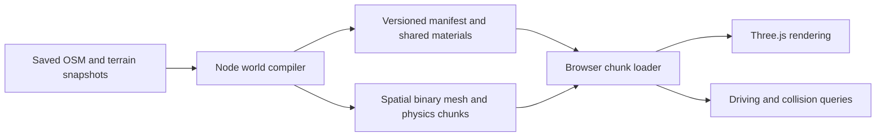

# Offline world compiler and runtime engine

The saved source snapshots are inputs to `npm run build`. The game loads the
resulting `dist/world/manifest.json` and compressed binary chunks. It never fetches
`dist/data/`, normalizes OSM tags, triangulates footprints, drapes surfaces or
places vegetation at runtime.

## Build and source ownership

Run `npm ci`, `npm run build`, `npm test`, and `npm run verify:world`.
`npm run dev` checks an input content hash and builds missing or stale output
before starting Vite. Node.js 22.12+ and the pinned Three.js dependency are enough;
Python and network data acquisition are unnecessary.

`dist/` remains authored source. **Only `dist/world/` is generated**, and it is
gitignored. Never run `vite build` over this checkout. A static deployment must
include the generated world. GitHub Pages compiles and verifies it before upload.
The existing private Sites deployment is unchanged and has not been published.

`scripts/build-world.mjs` orchestrates the build. `compile-city.mjs` handles OSM
deduplication, building heights, roofs, foundations and surface batching;
`compile-physics.mjs` emits local road segments and obstacle height intervals.
The existing `dist/road-model.js`, `terrain.js`, `street-details.js`, and
`realism.js` geometry algorithms are compiler dependencies and regression-test
entry points, excluded from the browser's import graph. The engine uses
`terrain-runtime.js`, `atmosphere.js`, and `road-material.js` instead.

New source adapters should consume saved local files and feed the compiler's
mesh/physics output, adding their inputs to `world-inputs.mjs` if outside the
existing data directory. Downloading or refreshing an upstream snapshot is a
separate, deliberate operation. The build's fetch adapter rejects network URLs.
The legacy Python preparation scripts remain optional tools for producing source
snapshots; some need external raw downloads as described in DEVELOPING.md.

## Artifact format

The manifest contains a format version, input hash, chunk bounds and content-hashed
filenames, shared material descriptions, POIs, prepared lamp positions and bridge
profiles, and terrain sampling metadata. The sampled DEM is a separate compressed
Float32 buffer used for vehicle and camera height queries.

Each gzip file contains a `CITY` magic number, JSON header length, an aligned JSON
header, then typed-array bytes. The header describes precomputed attributes,
indices, instance matrices, bounds, material references, layers, building picking
spans and physics. `world-format.js` creates buffer views directly over the decoded
payload. Buildings retain OSM IDs, height provenance and tags for inspection and
CSV export; obstacle polygons retain courtyard holes and vertical intervals.

Meshes use approximately 500 m spatial cells. Terrain retains its continuous
1.28 km patches, and features crossing cell edges retain their full bounds.
There can be several files per cell, produced from different source sections and
layers; the manifest's actual bounding boxes determine loading, not just cell IDs.
This keeps compiler memory bounded by a source section instead of the whole city's
mesh buffers. The source traversal and output buffers are deterministic.

Assets are content addressed and the manifest is replaced last, so an interrupted
build does not invalidate the previous manifest. Older hashed files are retained;
they may be removed from `dist/world/` when no running client uses the older build.
Clean CI checkouts publish only their current output. The original saved data and
attribution remain in the repository, available offline.

## Runtime work and limits

The loader fetches four nearby chunk files at a time, decompresses them using the
browser's DecompressionStream, creates GPU buffers and registers prepared physics
primitives in spatial indexes. Dynamic work consists of drawing, input, fixed-step
simulation, camera control, UI, opt-in sound and eight nearby lamp lights. Facade
and road shaders are reattached to shared materials rather than serialized hooks.

Driving preloads neighboring bounds and evicts chunks more than 3.5 km from the
camera target, disposing their geometry and instance buffers and rebuilding the
resident collision indexes. Eviction has hysteresis relative to the preload area.
The atlas's explicit **Load wider city** mode can retain the entire city; it is not
a bounded-memory mode. The global DEM, bridge profiles, POIs and lamp index remain
resident. This pass does not add LOD, texture streaming or traffic simulation.

`npm test` exercises the original geometry/physics behavior plus binary roundtrips,
instancing, picking metadata, collision holes/heights and the browser import boundary.
`npm run verify:world` scans every built chunk for valid geometry and references.
`npm run benchmark` exercises a real Chrome browser and records errors, requests,
timings and a screenshot; it requires an installed browser. Syntax/unit tests alone
do not establish rendered correctness, audio quality or GPU performance.
Use `npm run benchmark -- --world-smoke` to additionally check compiled building
picking, color modes, district streaming, driving eviction and source-free requests.
